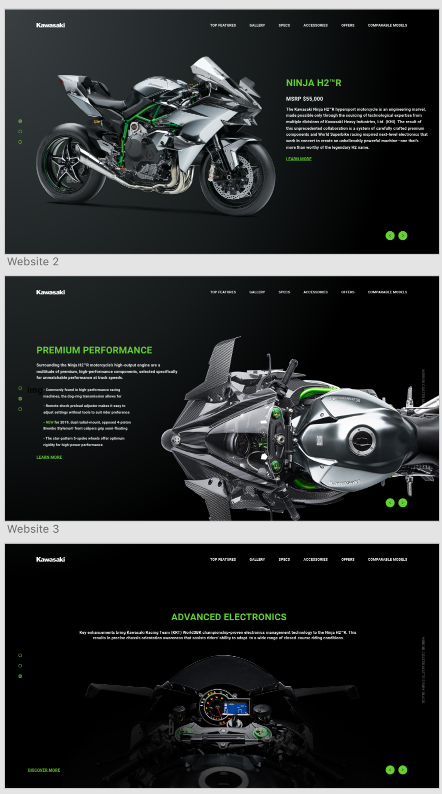
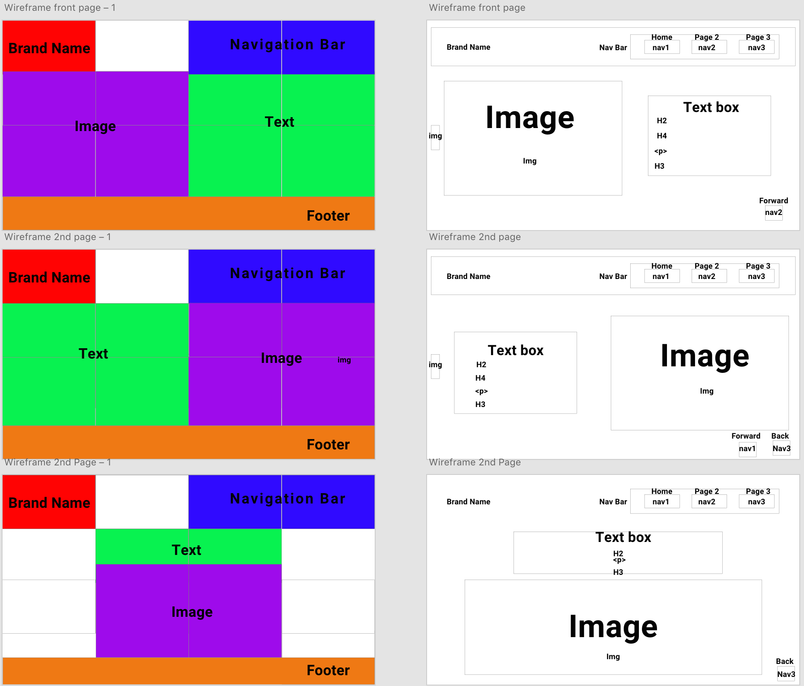
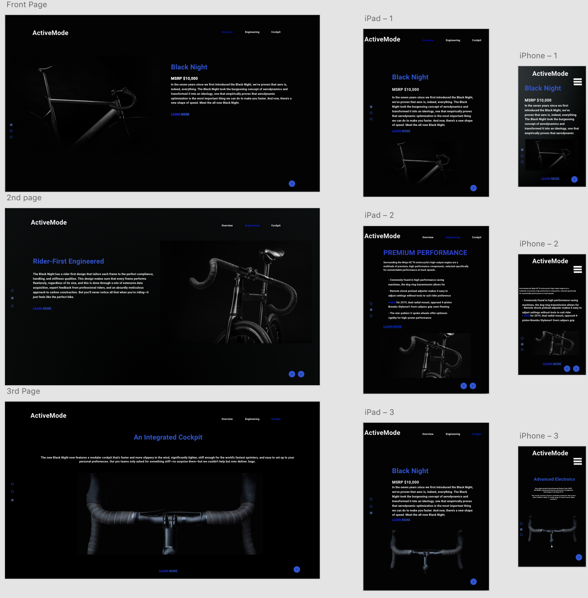

# Bike_Project

## Goal
Create a duplicate of a sample product landing page website with HTML and CSS.

## Tools used
* VS Code
* Adobe XD
* CSS grid
* CSS flexbox

## Template used as sample

Sample template of a product landing page.

## Wireframe design and layout

Adobe XD wireframe layout.

## Prototype of Bike Project (Web/Tablet/Phone)

Prototype layout of Bike project with Web/Tablet/Phone projected look.

## To do list
- [x] Write the README.MD
- [x] Add Template Photo
- [x] Add Wireframes
- [x] Add prototype Images
- [ ] Update the website

# Bike_project1
